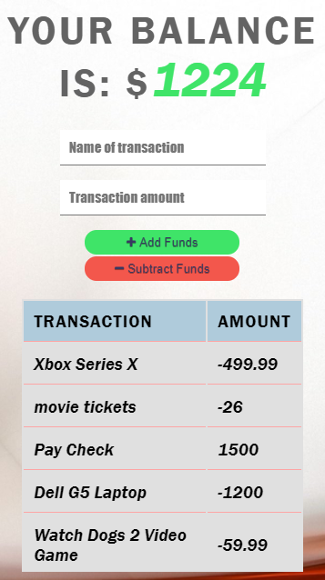
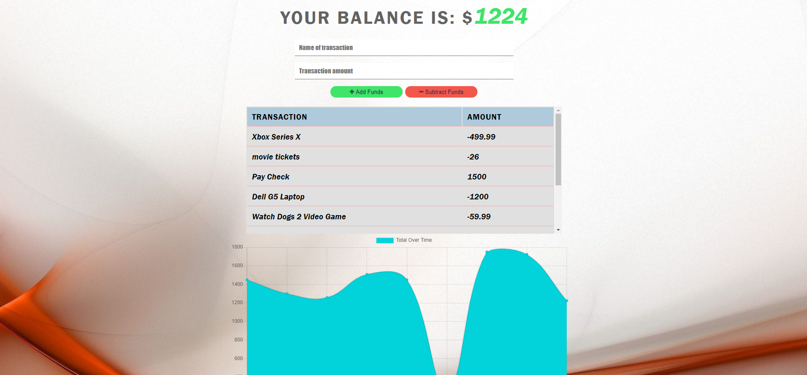

# **Budget Tracker**

## Description
``
The user will be able to add expenses and deposits to their budget with or without a connection. When entering transactions offline, they should populate the total when brought back online.

Offline Functionality:

  * Enter deposits offline

  * Enter expenses offline

When brought back online:

  * Offline entries should be added to tracker.
``
## Table of- Contents
- [Questions](#Questions)
- [Description](#Description)
- [License](#License)
- [Live App Link](#Live-App-Link)
- [Mobile Screen Capture](#Mobile-Screen-Capture)
- [Screen Capture](#Screen-Capture)
- [Repository Link](#Repository)
- [Contributors](#Contributors) 

## Live App Link

- [Heroku App Link](https://budget-tracker-84250.herokuapp.com/)

# Mobile screen capture

# Screen Capture

## License

## Contributors
``
Bobby Jones Jr.
``
## Repository

- [Project Repo](https://github.com/jones9682/Budget-Tracker)

## Questions

If you have any questions about the repo, open an issue or contact me directly at jones9682@yahoo.com. You can find more of my work at my [GitHub Profile](https://github.com/jones9682).